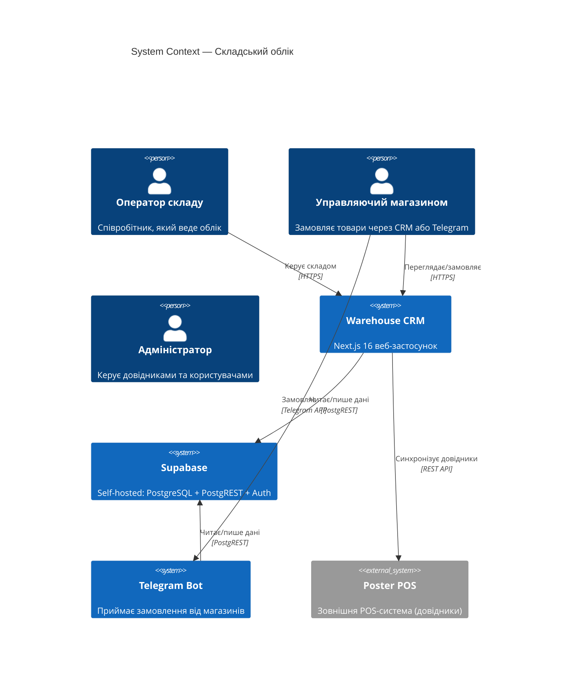
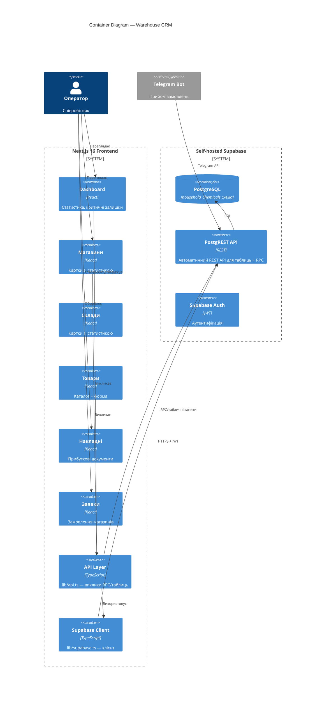
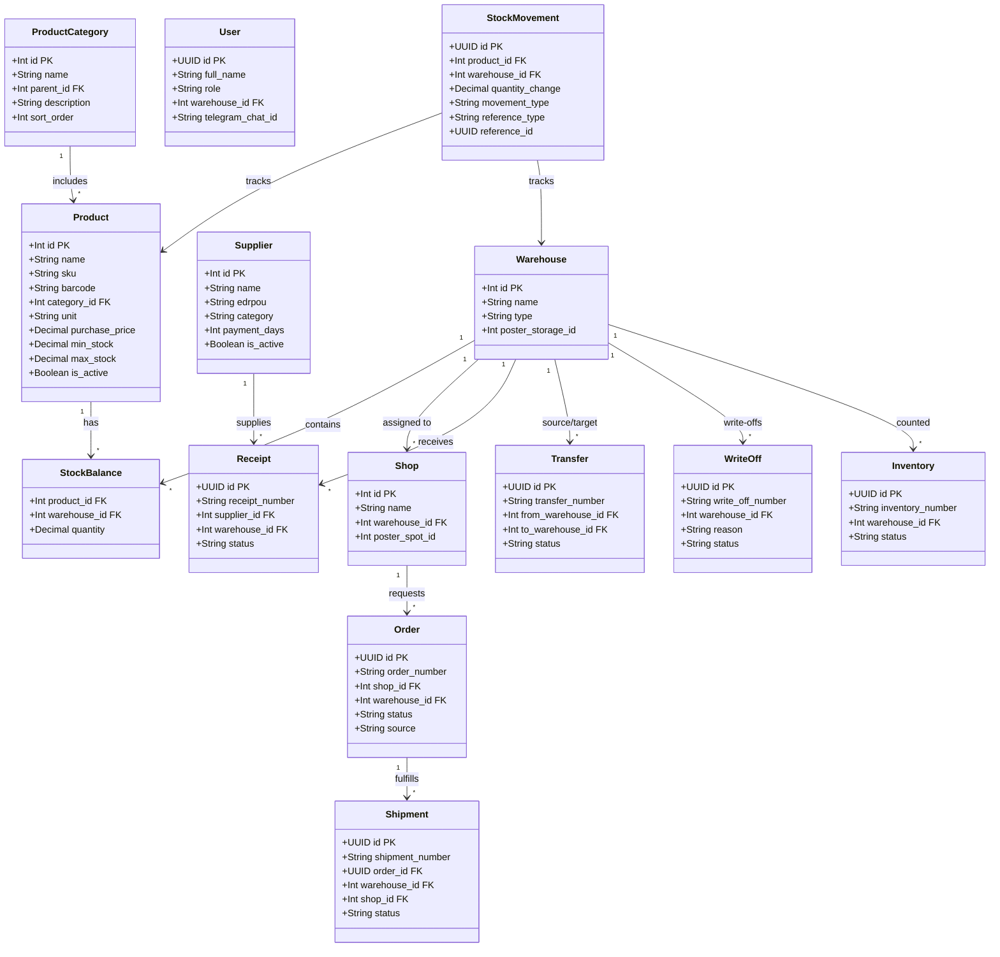
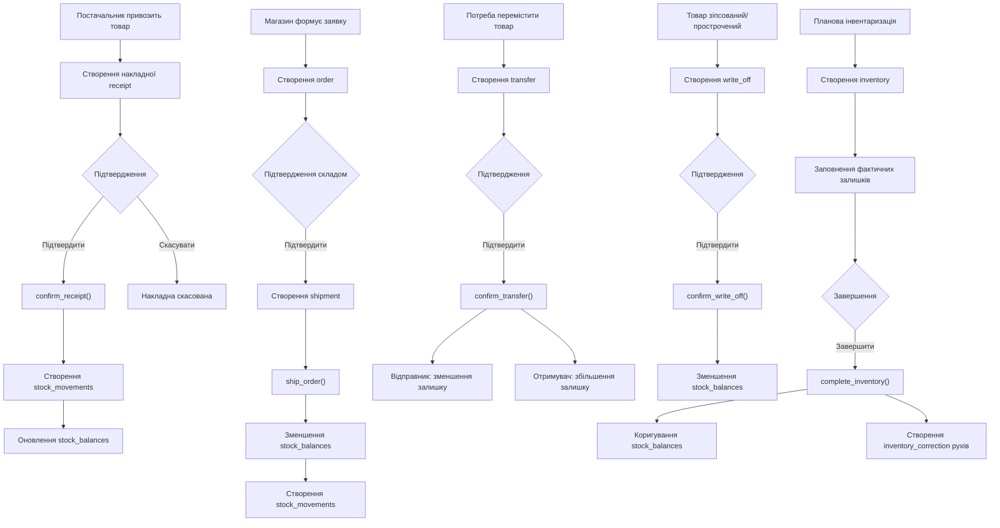
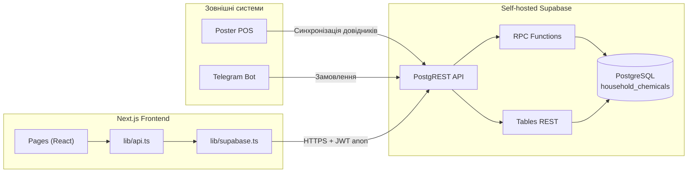
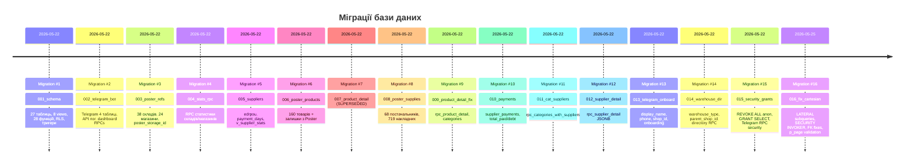

# Архітектура проєкту

**Проєкт:** Складський облік — Галя Балувана  
**Призначення:** Управління запасами побутової хімії, витратних матеріалів, упаковки та супутніх товарів мережі закладів "Галя Балувана" (Чернівці, 24+ магазини)  
**Стек:** Next.js 16 + Supabase (self-hosted) + PostgreSQL + Telegram Bot

---

## 1. Clean Architecture (4 рівні)





```mermaid
C4Component
  title Component Diagram — Серверна частина (PostgreSQL)

  ContainerDb(db, "PostgreSQL", "household_chemicals")

  System_Boundary(tables, "Таблиці (27)") {
    Component(refs, "Довідники", "categories, products, suppliers, warehouses, shops, users")
    Component(docs, "Документи", "receipts, orders, shipments, transfers, write_offs, inventories")
    Component(items, "Рядки документів", "receipt_items, order_items, shipment_items, transfer_items, write_off_items, inventory_items")
    Component(stock, "Складські залишки", "stock_balances, stock_movements")
    Component(audit, "Аудит", "audit_log")
    Component(telegram_tables, "Telegram", "telegram_chats/users/pending_orders/messages_log")
    Component(api_tables, "API", "api_integration_log, webhook_outbox, sync_status, document_sequences")
  }

  System_Boundary(functions, "Функції (28+)") {
    Component(rpc_business, "Бізнес-логіка", "confirm_receipt, ship_order, confirm_transfer, confirm_write_off, complete_inventory")
    Component(rpc_core, "Ядро", "update_stock_balance, log_action, get_user_role, next_document_number")
    Component(rpc_stats, "Статистика (SECURITY INVOKER)", "rpc_shops_with_stats, rpc_warehouses_with_stats, rpc_suppliers_with_stats, rpc_supplier_detail, rpc_categories_with_suppliers")
    Component(rpc_dashboard, "Дашборд (SECURITY INVOKER)", "rpc_dashboard_summary, rpc_orders_list, rpc_stock_movements_list")
    Component(rpc_catalog, "Каталог (SECURITY INVOKER)", "rpc_product_catalog, rpc_categories_tree, rpc_order_detail, rpc_warehouse_directory")
    Component(rpc_telegram, "Telegram", "telegram_get_or_create_user, telegram_create_order, telegram_get_catalog_text")
  }

  System_Boundary(triggers, "Тригери") {
    Component(trg_audit, "Аудит", "На всі таблиці: INSERT/UPDATE/DELETE")
    Component(trg_status, "Статуси", "На зміну статусу документів")
    Component(trg_webhook, "Webhook", "На зміну статусу замовлень")
  }

  System_Boundary(views, "Представлення (8)") {
    Component(v_dashboard, "v_dashboard_stats", "Статистика по складах (fixed #016)")
    Component(v_stock, "v_stock_summary", "Залишки з категоріями")
    Component(v_critical, "v_critical_stock", "Критичні залишки")
    Component(v_orders, "v_orders_with_details", "Замовлення з позиціями")
    Component(v_movements, "v_stock_movements_full", "Рухи товарів")
    Component(v_catalog, "v_product_catalog", "Каталог із залишками")
    Component(v_supplier, "v_supplier_stats", "Статистика постачальників (fixed #016)")
    Component(v_wh_dir, "v_warehouse_directory", "Довідник складів з типом")
  }

  Rel(tables, functions, "Використовує")
  Rel(triggers, functions, "Викликає")
  Rel(functions, tables, "Читає/пише")
  Rel(views, tables, "Будується на")
```

---

## 2. Domain Model (Clean Architecture)



---

## 3. ERD (Схема бази даних)

```mermaid
erDiagram
  product_categories ||--o{ products : category
  suppliers ||--o{ receipts : supplier
  warehouses ||--o{ shops : warehouse_link
  warehouses ||--o{ stock_balances : warehouse
  products ||--o{ stock_balances : product
  warehouses ||--o{ receipts : target
  receipts ||--o{ receipt_items : items
  products ||--o{ receipt_items : product
  shops ||--o{ orders : shop
  warehouses ||--o{ orders : warehouse
  orders ||--o{ order_items : items
  products ||--o{ order_items : product
  orders ||--o{ shipments : order_ref
  warehouses ||--o{ shipments : warehouse
  shops ||--o{ shipments : shop
  shipments ||--o{ shipment_items : items
  products ||--o{ shipment_items : product
  warehouses ||--o{ transfers : from_wh
  warehouses ||--o{ transfers : to_wh
  transfers ||--o{ transfer_items : items
  products ||--o{ transfer_items : product
  warehouses ||--o{ write_offs : warehouse
  write_offs ||--o{ write_off_items : items
  products ||--o{ write_off_items : product
  warehouses ||--o{ inventories : warehouse
  inventories ||--o{ inventory_items : items
  products ||--o{ inventory_items : product
  warehouses ||--o{ stock_movements : warehouse
  products ||--o{ stock_movements : product

  product_categories {
    int id PK
    text name
    int parent_id FK
    text description
    int sort_order
    boolean is_active
  }

  suppliers {
    int id PK
    text name
    text contact_person
    text phone
    text email
    text edrpou
    int payment_days
    text category
    boolean is_active
  }

  warehouses {
    int id PK
    text name
    text type
    int poster_storage_id UK
    text address
    boolean is_active
  }

  shops {
    int id PK
    text name UK
    int warehouse_id FK
    int poster_spot_id
    text address
    boolean is_active
  }

  products {
    int id PK
    text name
    text sku UK
    text barcode
    int category_id FK
    text unit
    numeric purchase_price
    numeric min_stock
    numeric max_stock
    boolean is_active
  }

  stock_balances {
    int id PK
    int product_id FK
    int warehouse_id FK
    numeric quantity
    UK product_id_warehouse_id
  }

  stock_movements {
    uuid id PK
    int product_id FK
    int warehouse_id FK
    numeric quantity_change
    numeric quantity_before
    numeric quantity_after
    text movement_type
    text reference_type
    uuid reference_id
  }

  receipts {
    uuid id PK
    text receipt_number
    int supplier_id FK
    int warehouse_id FK
    text status
    text notes
    uuid created_by FK
  }

  receipt_items {
    uuid id PK
    uuid receipt_id FK
    int product_id FK
    numeric quantity
    numeric price
    numeric total
  }

  orders {
    uuid id PK
    text order_number
    int shop_id FK
    int warehouse_id FK
    text status
    text source
    text notes
  }

  order_items {
    uuid id PK
    uuid order_id FK
    int product_id FK
    numeric quantity_requested
    numeric quantity_shipped
  }

  shipments {
    uuid id PK
    text shipment_number
    uuid order_id FK
    int warehouse_id FK
    int shop_id FK
    text status
  }

  shipment_items {
    uuid id PK
    uuid shipment_id FK
    uuid order_item_id FK
    int product_id FK
    numeric quantity
  }

  transfers {
    uuid id PK
    text transfer_number
    int from_warehouse_id FK
    int to_warehouse_id FK
    text status
  }

  transfer_items {
    uuid id PK
    uuid transfer_id FK
    int product_id FK
    numeric quantity
  }

  write_offs {
    uuid id PK
    text write_off_number
    int warehouse_id FK
    text reason
    text status
  }

  write_off_items {
    uuid id PK
    uuid write_off_id FK
    int product_id FK
    numeric quantity
    numeric price
  }

  inventories {
    uuid id PK
    text inventory_number
    int warehouse_id FK
    text status
  }

  inventory_items {
    uuid id PK
    uuid inventory_id FK
    int product_id FK
    numeric expected_quantity
    numeric actual_quantity
    numeric difference
  }

  audit_log {
    uuid id PK
    uuid user_id FK
    text user_name
    text action
    text entity_type
    text entity_id
    jsonb changes
    text summary
  }

  telegram_chats {
    int id PK
    bigint chat_id UK
    text title
    text type
    int warehouse_id FK
  }

  telegram_users {
    int id PK
    bigint user_id UK
    text username
    uuid household_user_id FK
  }

  telegram_pending_orders {
    uuid id PK
    int telegram_user_id FK
    bigint chat_id
    text step
    int shop_id FK
    jsonb items
  }

  document_sequences {
    int id PK
    text prefix
    int last_number
    int year
    UK prefix_year
  }
```

---

## 4. Бізнес-процеси



---

## 5. Схема потоку даних (API Layer)



---

## 6. Структура міграцій


