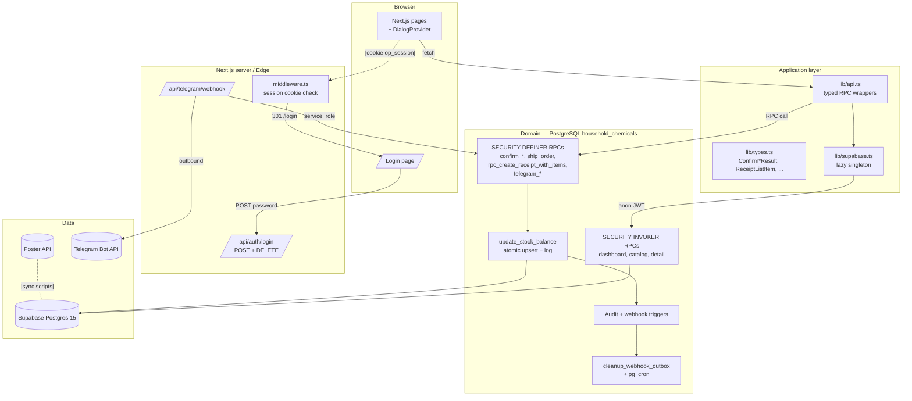
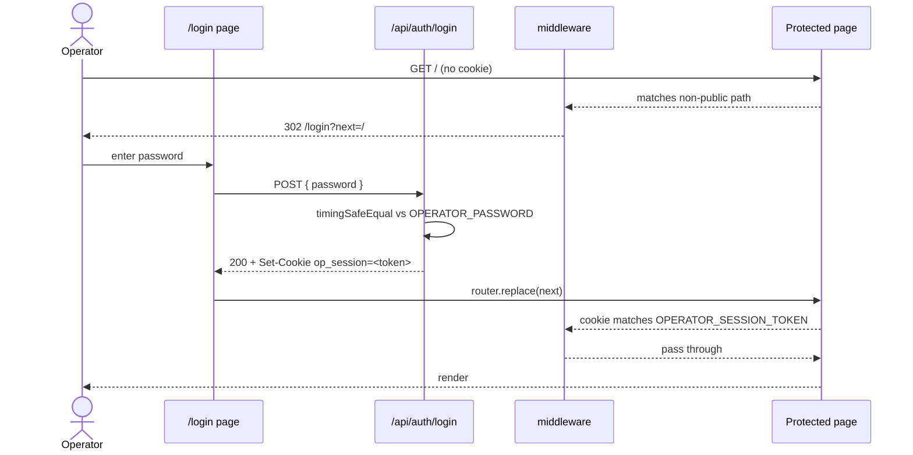
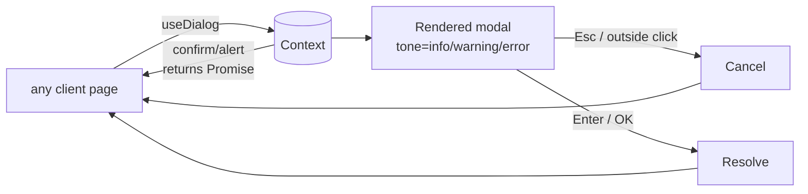
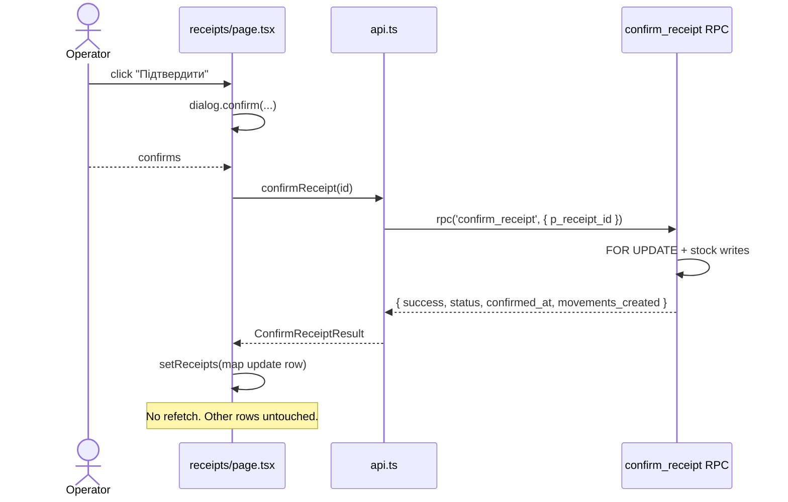

# Changes since migration 016

This document captures everything added/changed across migrations 017–025
plus the frontend additions made in the same code-review pass. Read it as
the delta layered on top of `clean-architecture.md`, `database-erd.md`,
`API.md`, and `openapi.yaml`.

## High-level summary

| Area | Change | Where |
|---|---|---|
| Stock atomicity | `update_stock_balance` now atomic; `ship_order`, `confirm_*`, `complete_inventory` take `FOR UPDATE` | mig 017, 019, 022, 025 |
| Receipt creation | Single atomic RPC `rpc_create_receipt_with_items` | mig 020 |
| Telegram bot | Pending order add is atomic; edit re-parse is atomic; warehouse derived from shop | mig 018, 021 |
| Audit | DELETE rows now logged; duplicate status triggers removed | mig 017, 019 |
| Sequences | Year + counter race fixed via `INSERT…RETURNING` | mig 024 |
| Indexes | `pg_trgm` GIN on `products.name/sku`; partial unique on `orders.telegram_message_id` | mig 019 |
| Outbox | `cleanup_webhook_outbox(p_days)` + optional `pg_cron` | mig 023 |
| Frontend types | `confirm_*` / `complete_inventory` return JSONB; list pages do local row update | mig 025 + `api.ts` |
| Operator login | Shared-password middleware + cookie | `src/middleware.ts`, `src/app/login`, `src/app/api/auth/login` |
| UI shell | `DialogProvider` + `useDialog()` replaces native `confirm()` / `alert()` | `src/components/DialogProvider.tsx` |
| Security ops | `SECURITY_ROTATION.md` checklist for key rotation + git history rewrite | repo root |

## Layered view (current)



## Migration-by-migration

### 017 — atomic stock, inventory fix, unique, audit dedup

- `complete_inventory` had `DECLARE v_diff NUMERIC` but the FOR-loop yielded a
  two-column record. Switched to `RECORD` and pass `v_row.diff`.
- `telegram_get_catalog_text` had `STRING_AGG` nested in another `STRING_AGG`.
  Rewrote as two CTEs.
- `telegram_pending_orders` got `UNIQUE (telegram_user_id, chat_id)` (idempotent
  via `DO $$ … pg_constraint check … $$`).
- `update_stock_balance` is now an atomic upsert that adds the delta in the
  `ON CONFLICT DO UPDATE` clause; prior+after values come from `RETURNING`.
- `ship_order` and `confirm_receipt` take `FOR UPDATE` locks on their parent
  row before computing anything. (Note: 017 broke `ship_order` semantics; see
  migration 019 for the restored version.)
- Duplicate status-change triggers (`trg_audit_status_<table>`) dropped on
  `receipts`, `orders`, `shipments`, `transfers`, `write_offs`, `inventories`.
  The generic `trg_audit_<table>` already records status changes once.
- `set_initial_stock` now computes a delta against the current balance instead
  of additively re-applying the input.
- `v_stock_summary` / `v_critical_stock` rebuilt to use `<=` consistently.

### 018 — atomic Telegram pending operations

- `rpc_pending_order_add_item(telegram_user_id, chat_id, product_id, quantity)`
  takes a `FOR UPDATE` lock, merges by `product_id` if already in the array,
  otherwise appends. Replaces a read-modify-write JS round-trip that lost
  items under rapid button taps.
- `rpc_telegram_replace_order_items(order_id, items JSONB)` locks the order,
  deletes existing items, bulk-inserts new ones — all in one transaction.
  Used by `handleEditedOrderMessage` when a group-chat order message is edited.

### 019 — compensating fix + indexes + audit DELETE

- **R1.** Migration 017 had partially rewritten `ship_order` and lost three
  NOT NULL columns (`shipment_number`, `shop_id`) plus the `shipment_items`
  insert. Restored full behavior:
    - allocate `shipment_number` via `next_document_number('SH')`,
    - insert `shipment_items` row per shipped product (skip rows with qty ≤ 0,
      respecting the CHECK on `shipment_items.quantity > 0`),
    - use `quantity_shipped` if > 0, fall back to `quantity_requested` for
      partial-ship semantics,
    - `FOR UPDATE` lock + status guard,
    - reflect what was actually shipped back onto `order_items.quantity_shipped`.
- **R2.** `REVOKE EXECUTE` on `update_stock_balance` and `set_initial_stock`
  from `anon`/`authenticated`/`PUBLIC`. These are low-level stock writers that
  must only be reached from other `SECURITY DEFINER` RPCs. Granted to
  `service_role` only.
- **R3.** `confirm_receipt` UPDATE was missing `updated_at = NOW()` — added.
- **R4.** `rpc_pending_order_add_item` parameter type widened to `NUMERIC(12,3)`
  to match `quantity_requested` precision.
- **M7.** `rpc_dashboard_summary` critical-stock CTE used `<` while the stats
  CTE used `<=`. Aligned both to `<=`.
- **M8.** `audit_trigger_func` had `RETURN OLD;` in the DELETE branch before
  the final `INSERT INTO audit_log`, so deletes were never logged.
  Restructured — INSERT first, then RETURN.
- **M10.** `pg_trgm` GIN indexes on `products.name` and `products.sku` so
  `name ILIKE '%foo%'` gets a Bitmap Index Scan.
- **H15.** Partial unique index `uq_orders_telegram_msg` on
  `orders(telegram_message_id) WHERE source = 'telegram'` — Telegram retries
  no longer double-insert the same order.

### 020 — atomic receipt creation

`rpc_create_receipt_with_items(supplier_id, warehouse_id, notes, items JSONB,
receipt_number, user_id)`:

- validates warehouse exists + is active,
- requires non-empty items,
- allocates `receipt_number` via `next_document_number('RCPT')` when caller
  omits it,
- inserts receipt header + bulk-inserts items in one transaction,
- raises on any per-item validation failure (product_id missing, qty ≤ 0).

Returns `{ success, receipt_id, receipt_number, items_inserted }`. Frontend
no longer talks to `next_document_number` directly (which had been REVOKEd
from anon in 015 and broke receipt creation).

### 021 — derive warehouse from shop

`telegram_create_order` previously had `p_warehouse_id INT DEFAULT 1`, which
meant any caller that forgot to pass the arg silently dropped the order onto
warehouse 1. Now `DEFAULT NULL` with a fallback to `shops.warehouse_id`;
raises if neither is provided. Function dropped+recreated; granted only to
`service_role`.

### 022 — Ukrainian movement notes

Translated `confirm_transfer` and `confirm_write_off` movement notes from
Russian to Ukrainian. Both also got `FOR UPDATE` locks + status guards to
match the rest of the family.

### 023 — webhook_outbox retention

`cleanup_webhook_outbox(p_days INT DEFAULT 30)` deletes `pending`/`failed`/
`cancelled` rows older than the cutoff. `sent` rows stay (kept auditable).
If `pg_cron` is installed, schedules `0 3 * * *` daily; otherwise call
manually or via an external scheduler.

### 024 — atomic sequence number

`next_document_number` previously read year into a local variable, then
INSERTed with `ON CONFLICT (prefix, year)`. The midnight race window allowed
the variable and the row to disagree on year. Fixed: compute year inside
INSERT, read it back via `RETURNING year, last_number`.

### 025 — confirm_* return JSONB

| RPC | Old | New |
|---|---|---|
| `confirm_receipt` | `void` | `{ success, receipt_id, status, confirmed_at, movements_created }` |
| `confirm_transfer` | `void` | `{ success, transfer_id, status, completed_at, movements_created }` |
| `confirm_write_off` | `void` | `{ success, write_off_id, status, confirmed_at, movements_created }` |
| `complete_inventory` | `void` | `{ success, inventory_id, status, completed_at, corrections_applied }` |

Signature change → DROP + CREATE (not `CREATE OR REPLACE`). Frontend
(`api.ts`) returns `Confirm*Result` / `CompleteInventoryResult` typed
objects, and list pages merge the result into local state instead of
re-fetching.

## Frontend additions (no migration tag)

### Operator login (S8)



Public paths bypass middleware: `/login`, `/api/telegram/webhook`, `/_next`,
`/favicon.ico`. With both env vars empty the middleware is a no-op (dev).

### DialogProvider



Replaces 6 native `confirm()` + 14 native `alert()` calls across inventory,
orders, orders/[id], write-offs, transfers, receipts, receipts/new,
products/new.

### Frontend ↔ confirm RPC flow (after 025)



## File map for the changes

```
warehouse-crm/
├── src/
│   ├── middleware.ts                      # new — S8 session gate
│   ├── components/
│   │   └── DialogProvider.tsx             # new — useDialog()
│   ├── app/
│   │   ├── login/page.tsx                 # new
│   │   ├── api/auth/login/route.ts        # new — POST login, DELETE logout
│   │   ├── layout.tsx                     # + DialogProvider wrap
│   │   └── ...page.tsx                    # all confirm()/alert() replaced
│   └── lib/
│       ├── api.ts                         # createReceiptWithItems, typed confirm_*
│       ├── supabase.ts                    # no more hardcoded fallback (throws)
│       └── types.ts                       # ConfirmReceiptResult & friends
├── supabase/migrations/household/
│   ├── 017_fix_inventory_atomic_stock_and_audit.sql
│   ├── 018_fix_atomic_pending_and_edit.sql
│   ├── 019_fix_ship_order_grants_audit_indexes.sql
│   ├── 020_rpc_create_receipt.sql
│   ├── 021_telegram_create_order_warehouse_from_shop.sql
│   ├── 022_ukrainian_notes.sql
│   ├── 023_webhook_outbox_retention.sql
│   ├── 024_next_document_number_year_safe.sql
│   └── 025_confirm_rpcs_return_jsonb.sql
└── docs/
    ├── CHANGES.md                         # this file
    ├── openapi.yaml                       # extended below
    ├── clean-architecture.md              # extended below
    └── database-erd.md                    # new indexes + cleanup_webhook_outbox
```

## Apply order

```
017 → 018 → 019 → 020 → 021 → 022 → 023 → 024 → 025
```

All idempotent. Functions use `DROP IF EXISTS` + `CREATE OR REPLACE`,
indexes use `IF NOT EXISTS`, constraints checked via `DO $$ pg_constraint`.
