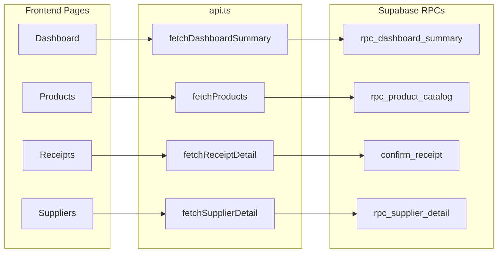
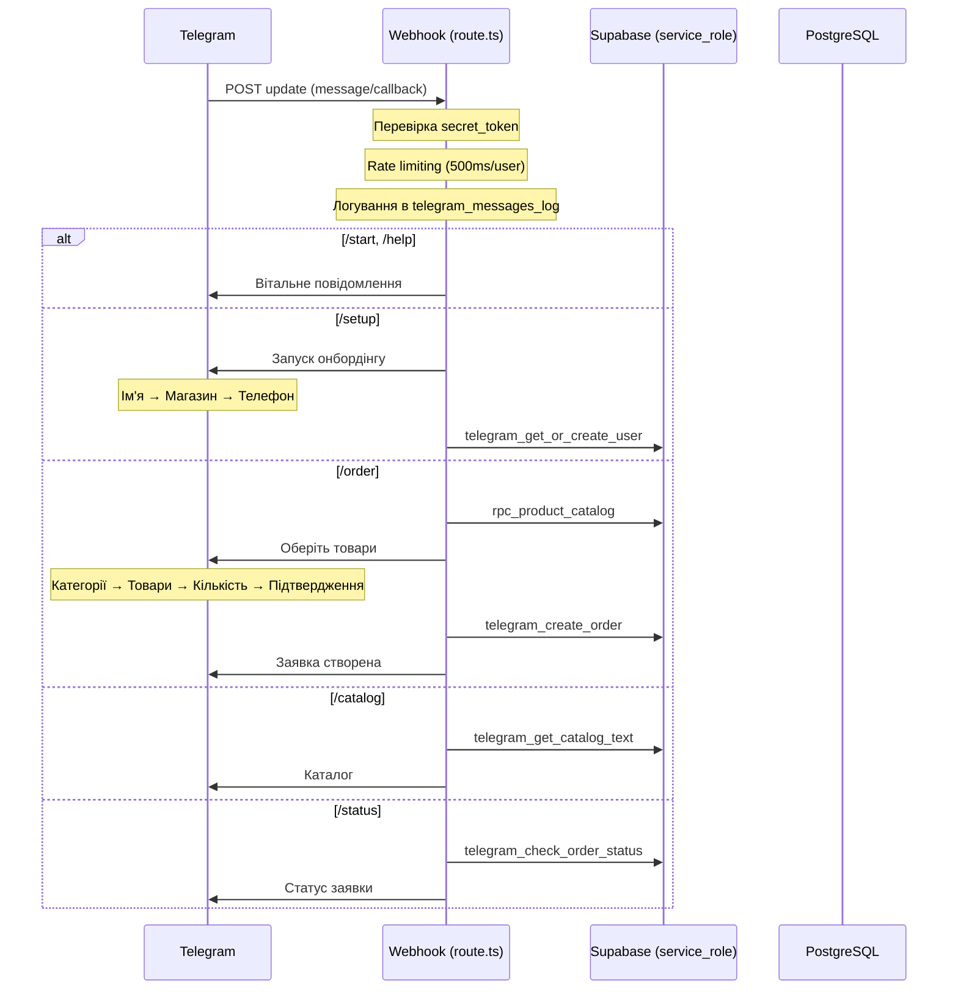
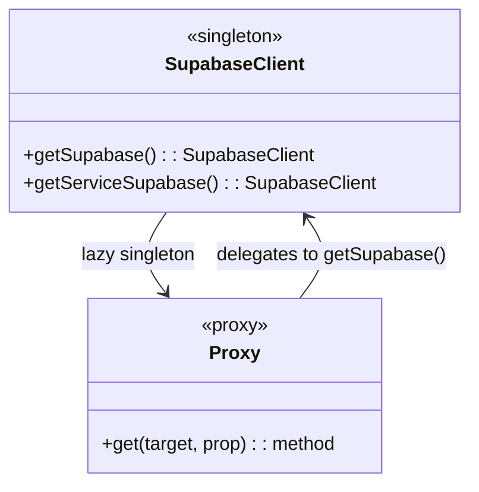
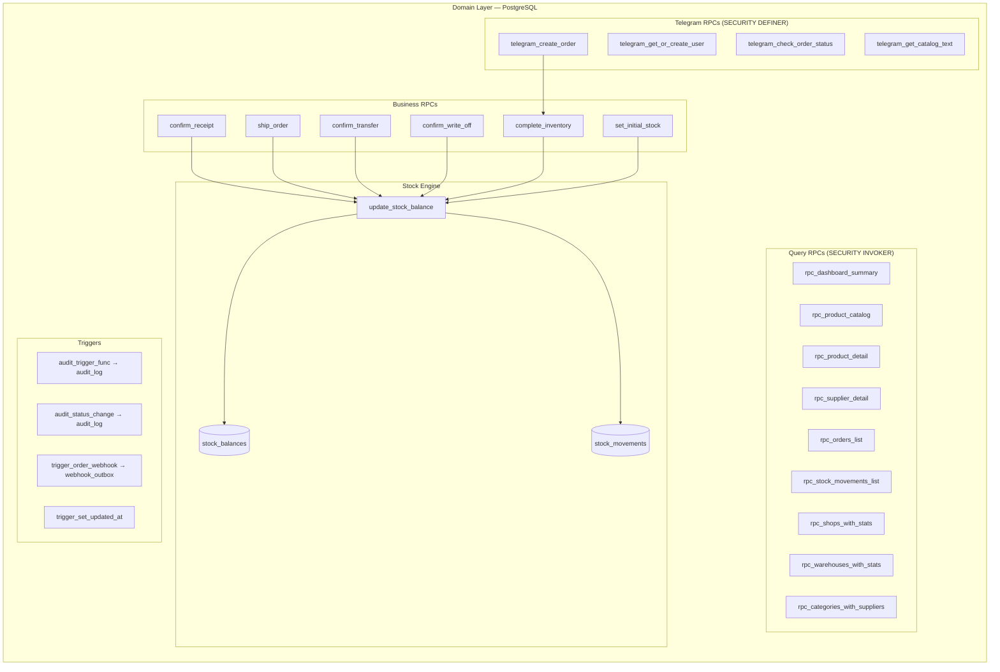
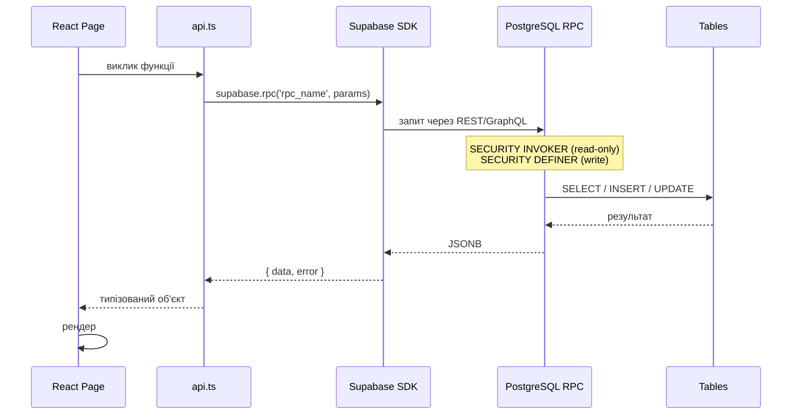

# Clean Architecture

## Огляд

Проєкт використовує Clean Architecture з трьома чіткими шарами. Відмінність від класичного підходу — **бізнес-логіка знаходиться в PostgreSQL**, а не в окремому бекенд-сервісі.

```
┌─────────────────────────────────────────────────────────────────┐
│                    PRESENTATION LAYER                           │
│  Next.js 16 App Router  │  React 19  │  Tailwind CSS v4         │
│  Sidebar  │  Dashboard  │  Products  │  Suppliers  │  Receipts  │
├─────────────────────────────────────────────────────────────────┤
│                    APPLICATION LAYER                            │
│  api.ts (RPC wrappers)  │  route.ts (Telegram webhook)          │
│  supabase.ts (client)   │  types.ts (interfaces)                │
├─────────────────────────────────────────────────────────────────┤
│                     DOMAIN LAYER                                │
│  PostgreSQL SECURITY DEFINER RPCs  │  Triggers                   │
│  Business Logic  │  Stock management  │  Document flow           │
├─────────────────────────────────────────────────────────────────┤
│                    DATA / INFRASTRUCTURE                         │
│  Supabase (PostgreSQL 15)  │  Poster API  │  Telegram API         │
│  30 tables  │  8 views  │  RLS  │  Audit logging                │
└─────────────────────────────────────────────────────────────────┘
```

## Потік залежностей

```
Presentation → Application → Domain (PostgreSQL RPCs)
     │              │                │
     └──────┬───────┘                │
            │                        │
     Supabase SDK              SECURITY INVOKER (read-only RPCs)
     (household_chemicals       SECURITY DEFINER (write RPCs,
      schema)                   Telegram RPCs)
```

Всі шари залежать від **Domain Layer**, який є центральним і не залежить ні від чого.
Read-only RPCs (статистика, каталог) працюють як `SECURITY INVOKER`, тому на них діють RLS політики анонімного користувача.
Бізнес-логіка (проведення документів, Telegram RPCs) працює як `SECURITY DEFINER` — з правами власника схеми.

---

## Шар 1: Presentation Layer (Next.js)

**Відповідальність**: UI, маршрутизація, візуалізація даних.

### Page Routes

```mermaid
graph TD
    subgraph "Presentation Layer"
        direction LR
        D[Dashboard /]
        P[Products /products]
        PD[Product Detail /products/[id]]
        PE[Product Edit /products/[id]/edit]
        PN[New Product /products/new]
        S[Suppliers /suppliers]
        SD[Supplier Detail /suppliers/[id]]
        R[Receipts /receipts]
        RD[Receipt Detail /receipts/[id]]
        RN[New Receipt /receipts/new]
        O[Orders /orders]
        SH[Shipments /shipments]
        TR[Transfers /transfers]
        WO[Write-offs /write-offs]
        I[Inventory /inventory]
        W[Warehouses /warehouses]
        SP[Shops /shops]
        A[Audit /audit]
    end

    D --> P
    D --> R
    D --> O
    P --> PD
    PD --> PE
    S --> SD
    R --> RD
```

### Компоненти

| Компонент | Файл | Призначення |
|---|---|---|
| `Sidebar` | `components/Sidebar.tsx` | Бокова навігація з колапсом |
| `ExportButton` | `components/ExportButton.tsx` | Експорт в XLSX |

### Стилізація

- Tailwind CSS v4
- CSS custom properties (`--color-*`) для брендування
- Inter font через `next/font/google`
- Responsive дизайн (mobile first)

---

## Шар 2: Application Layer

**Відповідальність**: координація, адаптація даних, інтеграція.

### 2.1 API Wrappers (`lib/api.ts`)



| Функція | Тип | Опис |
|---|---|---|
| `fetchDashboardSummary()` | RPC (SECURITY INVOKER) | Статистика + критичні товари + рухи |
| `fetchProducts()` | RPC | Каталог з пагінацією |
| `fetchProductDetail()` | RPC | Деталі товару (залишки, ціни, накладні) |
| `fetchCategoriesTree()` | RPC | Ієрархічні категорії |
| `fetchCategoriesWithProducts()` | RPC | Категорії з товарами |
| `fetchSuppliersWithStats()` | RPC | Постачальники зі статистикою |
| `fetchSupplierDetail()` | RPC | Деталі постачальника |
| `fetchSupplierPayments()` | Direct | Платежі постачальнику |
| `fetchCategoriesWithSuppliers()` | RPC | Категорії з постачальниками |
| `fetchOrders()` | RPC | Заявки з фільтрацією |
| `fetchOrderDetail()` | RPC | Деталі заявки |
| `fetchStockMovements()` | RPC | Журнал рухів |
| `fetchReceipts()` | Direct | Накладні |
| `fetchReceiptDetail()` | Direct | Деталі накладної |
| `createProduct()` | Direct | Створення товару |
| `updateProduct()` | Direct | Оновлення товару |
| `confirmReceipt()` | RPC | Проведення накладної |
| `shipOrder()` | RPC | Відвантаження за заявкою |
| `confirmTransfer()` | RPC | Проведення переміщення |
| `confirmWriteOff()` | RPC | Проведення списання |
| `completeInventory()` | RPC | Завершення інвентаризації |
| `createSupplierPayment()` | Direct | Додати платіж |

### 2.2 Telegram Webhook (`route.ts`)

Єдина публічна API route — обробник Telegram Bot.

**Ендпоінт**: `POST /api/telegram/webhook`

**Потік обробки**:



### 2.3 Supabase Client (`lib/supabase.ts`)



- **`getSupabase()`** — анонімний клієнт для фронтенду (SELECT + `SECURITY INVOKER` RPCs)
- **`getServiceSupabase()`** — service_role клієнт для Telegram webhook (RLS bypass, викликає `SECURITY DEFINER` Telegram RPCs)
- **Прокидає `TELEGRAM_WEBHOOK_SECRET`** — перевіряє `X-Telegram-Bot-Api-Secret-Token` з env
- **Proxy** — дозволяє використовувати `supabase.rpc()` без явного виклику `getSupabase()`
- Схема за замовчуванням: `household_chemicals`
- Rate limiting: 500ms між повідомленнями від одного користувача

---

## Шар 3: Domain Layer (PostgreSQL)

**Відповідальність**: бізнес-логіка, валідація, цілісність даних.

### Діаграма компонентів



### Бізнес-правила

| Правило | Реалізація |
|---|---|
| Оприбуткування → +stock | `confirm_receipt()` → `update_stock_balance()` |
| Списання → -stock | `confirm_write_off()` → `update_stock_balance()` |
| Переміщення → -source, +target | `confirm_transfer()` → 2× `update_stock_balance()` |
| Заявка → shipment → -stock | `ship_order()` → створює shipment → `update_stock_balance()` |
| Інвентаризація → +/-stock | `complete_inventory()` → `update_stock_balance(diff)` |
| Кількість > 0 | CHECK `(quantity > 0)` на всіх item tables |
| Статусний lifecycle | CHECK з переліком допустимих статусів |
| Кожна зміна → audit_log | Тригери на 19 таблицях |
| Зміна статусу → webhook | Тригер `trigger_order_webhook` |

---

## Шар 4: Data / Infrastructure Layer

**Відповідальність**: зберігання, зовнішні інтеграції.

### 4.1 Database

```mermaid
graph LR
    subgraph "PostgreSQL (Supabase)"
        subgraph "Schema: household_chemicals"
            direction TB
            REF[Reference Data<br/>categories, products,<br/>suppliers, warehouses, shops]
            DOC[Documents<br/>receipts, orders,<br/>shipments, transfers, write-offs]
            STK[Stock<br/>stock_balances,<br/>stock_movements]
            AUD[Audit<br/>audit_log]
            TEL[Telegram<br/>telegram_* tables]
            INT[Integration<br/>api_integration_log,<br/>webhook_outbox, sync_status]
        end
    end
    
    subgraph "External"
        POSTER[Poster API]
        TELEGRAM[Telegram Bot API]
    end

    POSTER --> INT : синхронізація
    TELEGRAM --> TEL : webhook
    TEL --> DOC : telegram_create_order
```

### 4.2 Інтеграції

| Система | Напрям | Протокол | Дані |
|---|---|---|---|
| Poster API | Import | REST (token auth) | Товари, залишки, постачання, склади, магазини |
| Telegram Bot API | Bidirectional | Webhook (POST) | Замовлення, каталог, онбординг |

### 4.3 Security Model

```mermaid
graph TD
    subgraph "Access Levels"
        ANON[anon / authenticator]
        AUTH[authenticated]
        SRV[service_role]
    end

    subgraph "What they can do"
        ANON -->|SELECT only + SECURITY INVOKER RPCs| TABLES[(All Tables)]
        ANON -->|Execute read-only RPCs| SAFE[Read-only RPCs<br/>(SECURITY INVOKER)]
        AUTH -->|SELECT| TABLES
        AUTH -->|INSERT/UPDATE| TABLES_WRITE[(Tables - with role check)]
        SRV -->|ALL| ALL[(Everything)]
        SRV -->|Telegram RPCs + Business RPCs| TELR[Telegram + Business functions<br/>(SECURITY DEFINER)]
    end

    subgraph "Role checks"
        TABLES_WRITE -->|get_user_role| ADMIN[admin]
        TABLES_WRITE -->|get_user_role| OP[warehouse_operator]
        TABLES_WRITE -->|get_user_role| SM[shop_manager (orders only)]
    end

    subgraph "Rate limiting"
        RL[500ms between messages<br/>per Telegram user_id]
    end
    SAFE --> RL
```

---

## Потік даних: від UI до БД і назад



---

## Структура міграцій

```
warehouse-crm/                          supabase/migrations/household/
├── 001_full_warehouse_schema.sql  ──►  ├── 001_full_warehouse_schema.sql
├── 002_telegram_bot_and_api_layer.sql  ├── 002_telegram_bot_and_api_layer.sql
├── ...                                 ├── ...
├── 015_fix_security_grants.sql         ├── 015_fix_security_grants.sql
└── 016_fix_cartesian_grants_and_...    └── 016_fix_cartesian_grants_and_...
```

Кожна міграція існує в обох директоріях (для git та для Supabase Studio).
Міграція #007 (SUPERSEDED #009) не застосовується.
