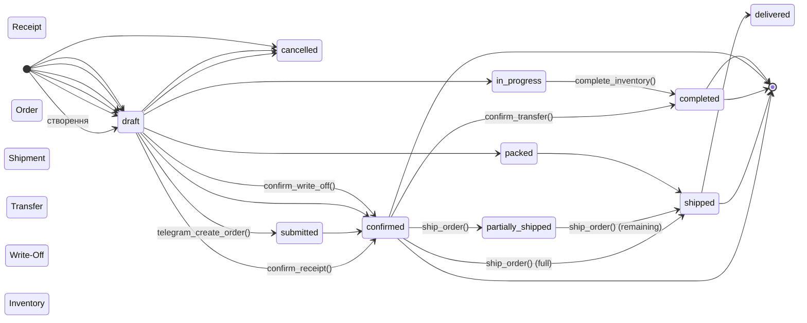

# Database ERD

## Повна схема бази даних

```mermaid
erDiagram
    %% =====================================================================
    %% REFERENCE DATA
    %% =====================================================================
    product_categories {
        int id PK
        text name
        int parent_id FK
        text description
        int sort_order
        boolean is_active
        timestamptz created_at
    }
    
    products {
        int id PK
        text name
        text sku UK
        text barcode
        int category_id FK
        text unit
        numeric purchase_price
        numeric min_stock
        numeric max_stock
        text description
        boolean is_active
        timestamptz created_at
        timestamptz updated_at
    }
    
    suppliers {
        int id PK
        text name
        text contact_person
        text phone
        text email
        text address
        text edrpou
        int payment_days
        text category
        text website
        text notes
        boolean is_active
        timestamptz created_at
        timestamptz updated_at
    }
    
    warehouses {
        int id PK
        text name
        text type
        int poster_storage_id
        text warehouse_type
        int parent_shop_id FK
        text address
        text contact_person
        text phone
        boolean is_active
        timestamptz created_at
    }
    
    shops {
        int id PK
        text name UK
        text code UK
        int warehouse_id FK
        int poster_spot_id
        text address
        text phone
        boolean is_active
        timestamptz created_at
    }
    
    users {
        uuid id PK
        uuid auth_user_id FK
        text full_name
        text role
        int warehouse_id FK
        text phone
        text telegram_chat_id
        boolean is_active
        timestamptz created_at
        timestamptz updated_at
    }

    %% =====================================================================
    %% DOCUMENTS — RECEIPTS
    %% =====================================================================
    receipts {
        uuid id PK
        text receipt_number
        int supplier_id FK
        int warehouse_id FK
        text notes
        text status
        uuid created_by FK
        timestamptz confirmed_at
        timestamptz created_at
        timestamptz updated_at
    }
    
    receipt_items {
        uuid id PK
        uuid receipt_id FK
        int product_id FK
        numeric quantity
        numeric price
        numeric total "GENERATED ALWAYS"
        timestamptz created_at
    }

    %% =====================================================================
    %% DOCUMENTS — ORDERS
    %% =====================================================================
    orders {
        uuid id PK
        text order_number
        int shop_id FK
        int warehouse_id FK
        text status
        text source
        text telegram_message_id
        text notes
        uuid created_by FK
        uuid confirmed_by FK
        timestamptz submitted_at
        timestamptz confirmed_at
        timestamptz shipped_at
        timestamptz created_at
        timestamptz updated_at
    }
    
    order_items {
        uuid id PK
        uuid order_id FK
        int product_id FK
        numeric quantity_requested
        numeric quantity_shipped
        text notes
        timestamptz created_at
        timestamptz updated_at
    }

    %% =====================================================================
    %% DOCUMENTS — SHIPMENTS
    %% =====================================================================
    shipments {
        uuid id PK
        text shipment_number
        uuid order_id FK
        int warehouse_id FK
        int shop_id FK
        text status
        text notes
        uuid created_by FK
        timestamptz shipped_at
        timestamptz delivered_at
        timestamptz created_at
        timestamptz updated_at
    }
    
    shipment_items {
        uuid id PK
        uuid shipment_id FK
        uuid order_item_id FK
        int product_id FK
        numeric quantity
        timestamptz created_at
    }

    %% =====================================================================
    %% DOCUMENTS — TRANSFERS
    %% =====================================================================
    transfers {
        uuid id PK
        text transfer_number
        int from_warehouse_id FK
        int to_warehouse_id FK
        text status
        text notes
        uuid created_by FK
        uuid confirmed_by FK
        timestamptz created_at
        timestamptz completed_at
    }
    
    transfer_items {
        uuid id PK
        uuid transfer_id FK
        int product_id FK
        numeric quantity
        timestamptz created_at
    }

    %% =====================================================================
    %% DOCUMENTS — WRITE-OFFS
    %% =====================================================================
    write_offs {
        uuid id PK
        text write_off_number
        int warehouse_id FK
        text reason
        text notes
        text status
        uuid created_by FK
        uuid confirmed_by FK
        timestamptz created_at
        timestamptz confirmed_at
    }
    
    write_off_items {
        uuid id PK
        uuid write_off_id FK
        int product_id FK
        numeric quantity
        numeric price
        text notes
        timestamptz created_at
    }

    %% =====================================================================
    %% DOCUMENTS — INVENTORIES
    %% =====================================================================
    inventories {
        uuid id PK
        text inventory_number
        int warehouse_id FK
        text status
        text notes
        uuid created_by FK
        uuid completed_by FK
        timestamptz created_at
        timestamptz completed_at
    }
    
    inventory_items {
        uuid id PK
        uuid inventory_id FK
        int product_id FK
        numeric expected_quantity
        numeric actual_quantity
        numeric difference "GENERATED ALWAYS"
        text notes
        timestamptz created_at
    }

    %% =====================================================================
    %% STOCK
    %% =====================================================================
    stock_balances {
        int id PK
        int product_id FK UK
        int warehouse_id FK UK
        numeric quantity
        timestamptz updated_at
    }
    
    stock_movements {
        uuid id PK
        int product_id FK
        int warehouse_id FK
        numeric quantity_change
        numeric quantity_before
        numeric quantity_after
        text movement_type
        text reference_type
        uuid reference_id
        text notes
        uuid created_by FK
        timestamptz created_at
    }

    %% =====================================================================
    %% AUDIT
    %% =====================================================================
    audit_log {
        uuid id PK
        uuid user_id FK
        text user_name
        text action
        text entity_type
        text entity_id
        jsonb changes
        text summary
        text ip_address
        text user_agent
        timestamptz created_at
    }

    %% =====================================================================
    %% TELEGRAM
    %% =====================================================================
    telegram_chats {
        int id PK
        bigint chat_id UK
        text title
        text type
        int warehouse_id FK
        boolean is_active
        timestamptz created_at
    }
    
    telegram_users {
        int id PK
        bigint user_id UK
        text username
        text first_name
        text last_name
        text display_name
        text phone
        int shop_id FK
        uuid household_user_id FK
        boolean is_active
        timestamptz last_interaction_at
        timestamptz created_at
    }
    
    telegram_pending_orders {
        uuid id PK
        int telegram_user_id FK
        bigint chat_id
        text step
        int shop_id FK
        jsonb items
        int message_id
        timestamptz created_at
        timestamptz updated_at
    }
    
    telegram_messages_log {
        uuid id PK
        int telegram_user_id FK
        bigint chat_id
        int message_id
        text message_type
        text text_content
        text parsed_command
        jsonb parsed_data
        text ai_response
        int processing_time_ms
        text error
        timestamptz created_at
    }

    %% =====================================================================
    %% INTEGRATION
    %% =====================================================================
    api_integration_log {
        uuid id PK
        text direction
        text method
        text endpoint
        jsonb request_headers
        jsonb request_body
        int response_status
        jsonb response_body
        text source
        int duration_ms
        text error_message
        uuid created_by FK
        timestamptz created_at
    }
    
    webhook_outbox {
        uuid id PK
        text event_type
        jsonb payload
        text target_url
        text target_system
        text status
        int attempts
        int max_attempts
        text last_error
        timestamptz next_retry_at
        timestamptz created_at
        timestamptz sent_at
    }
    
    sync_status {
        int id PK
        text source UK
        text entity_type UK
        timestamptz last_sync_at
        text status
        text error_message
        int rows_processed
        jsonb details
        timestamptz created_at
        timestamptz updated_at
    }
    
    document_sequences {
        int id PK
        text prefix UK
        int last_number
        int year UK
    }
    
    supplier_payments {
        uuid id PK
        int supplier_id FK
        numeric amount
        date payment_date
        text payment_method
        text reference_number
        text notes
        uuid created_by FK
        timestamptz created_at
        timestamptz updated_at
    }
```

## Зв'язки між таблицями

### Справочники

```
product_categories 1──* product_categories (parent_id → id)
product_categories 1──* products (category_id)

suppliers 1──* receipts
suppliers 1──* supplier_payments

warehouses 1──* receipts
warehouses 1──* orders
warehouses 1──* shipments
warehouses 1──* transfers (from_warehouse_id / to_warehouse_id)
warehouses 1──* write_offs
warehouses 1──* inventories
warehouses 1──* stock_balances
warehouses 1──* stock_movements
warehouses 1──* shops (warehouse_id)
warehouses 1──* warehouses (parent_shop_id)

shops 1──* orders
shops 1──* shipments
shops 1──* telegram_users (shop_id)
shops 1──* telegram_pending_orders (shop_id)

products 1──* receipt_items
products 1──* order_items
products 1──* shipment_items
products 1──* transfer_items
products 1──* write_off_items
products 1──* inventory_items
products 1──* stock_balances
products 1──* stock_movements
```

### Документи → Товари

```
receipts 1──* receipt_items
orders 1──* order_items
shipments 1──* shipment_items
transfers 1──* transfer_items
write_offs 1──* write_off_items
inventories 1──* inventory_items
```

### Telegram
    
```
telegram_users 1──* telegram_pending_orders (ON DELETE CASCADE)
telegram_users 1──* telegram_messages_log (ON DELETE CASCADE)
telegram_chats 1──* telegram_messages_log
telegram_users *──1 shops (shop_id → ON DELETE SET NULL)
```

**Migration #016 FK changes:**
- `supplier_payments.supplier_id` → `ON DELETE RESTRICT` (було CASCADE)
- `users.auth_user_id` → `ON DELETE SET NULL` (було CASCADE)
- `telegram_users.shop_id` → `ON DELETE SET NULL` (додано)

---

## Views (8 total)

```mermaid
erDiagram
    v_stock_summary {
        int warehouse_id
        text warehouse_name
        int product_id
        text product_name
        text sku
        text unit
        int category_id
        text category_name
        numeric quantity
        numeric min_stock
        numeric max_stock
        text stock_status
        timestamptz updated_at
    }
    
    v_critical_stock {
        "SELECT * FROM v_stock_summary WHERE stock_status = 'critical'"
    }
    
    v_orders_with_details {
        "Orders + shops + warehouses + users + items count"
    }
    
    v_stock_movements_full {
        "Stock movements + products + warehouses + users"
    }
    
    v_dashboard_stats {
        "Statistics per warehouse (fixed Cartesian multiplication in #016)"
    }
    
    v_product_catalog {
        "Full catalog with stock_by_warehouse JSONB"
    }
    
    v_supplier_stats {
        "Supplier statistics with payments (r.status = 'confirmed' filter in #016)"
    }
    
    v_warehouse_directory {
        "Warehouses with type and parent shop name"
    }
```

---

## Діаграма lifecycle документів


